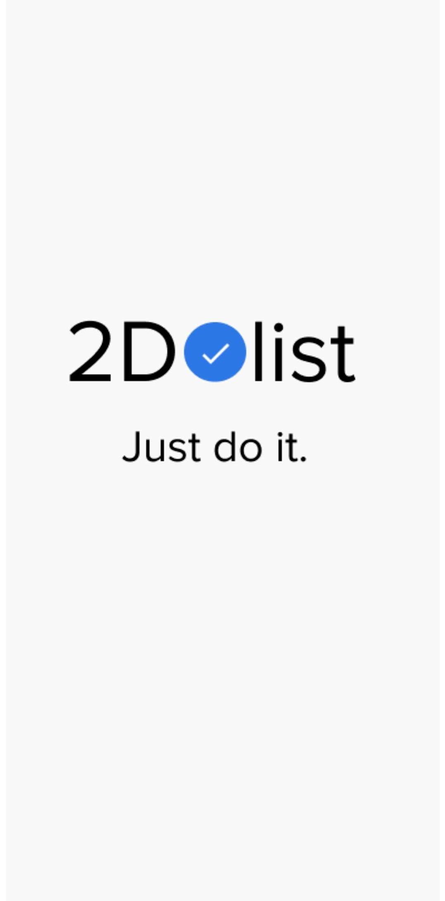
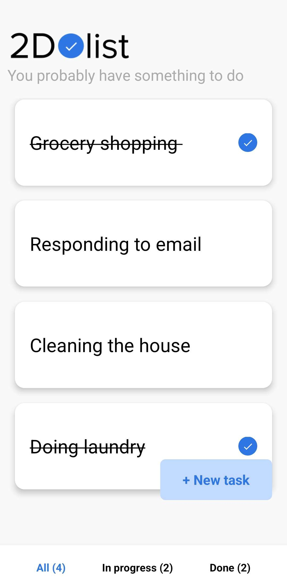
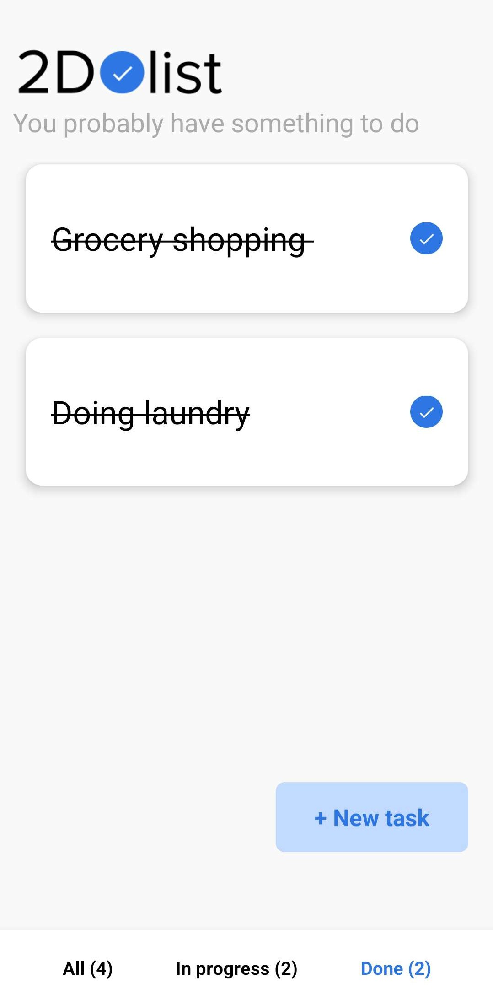
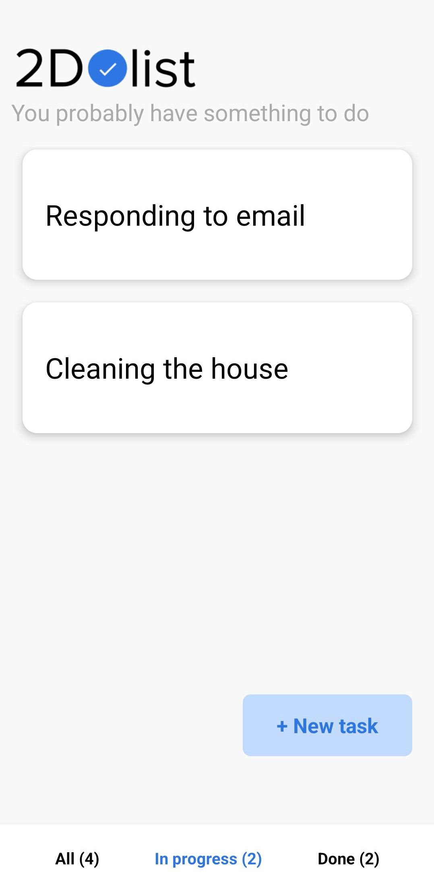
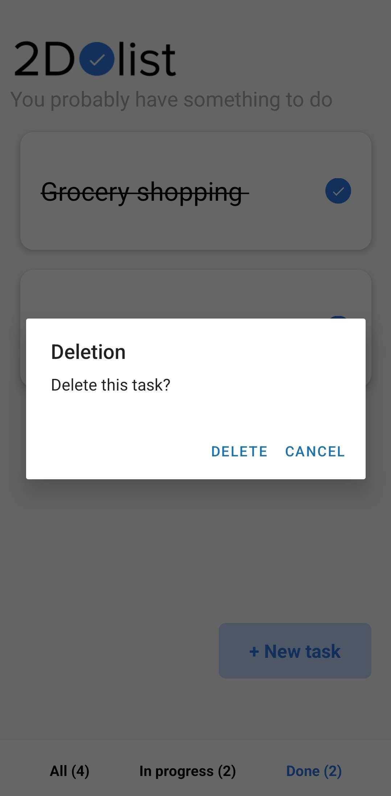

# Todo List Application

Ce projet est une application mobile todolist développée en React Native et avec Expo.

# Informations

- [Télécharger l'app pour Android](https://github.com/SebastienCozeDev/todolist-app/releases/download/v1.0.1/todolist-app-latest.apk).
- [Voir le code](https://github.com/SebastienCozeDev/todolist-app).

## Installation

Utilisez le gestionnaire de paquets [npm](https://www.npmjs.com/) pour installer les dépendances.

```bash
npm install
```

## Utilisation

Pour lancer le projet, utilisez la commande suivante :

```bash
npx expo start
```

Vous pouvez ensuite utiliser l'application Expo Go sur votre téléphone pour scanner le QR code et exécuter l'app sur votre téléphone.

## Build

Pour compiler le projet, utilisez la commande suivante :

```bash
eas build -p android --profile preview
```

Vous pourrez ensuite télécharger le fichier APK depuis le [site Expo](https://expo.io/).

## Captures d'écran

### Écran de démarrage



### Onglet Toutes les tâches



### Onglet Tâches terminées



### Onglet Tâches en cours



### Modal Créer une tâche


### Modal Supprimer une tâche



## Fonctionnalités

- Ajouter une tâche
- Supprimer une tâche
- Marquer une tâche comme terminée
- Sauvegarder les tâches en stockage local
- Charger les tâches depuis le stockage local
- Afficher le nombre total de tâches
- Afficher le nombre de tâches terminées
- Afficher le nombre de tâches en cours
- Afficher la liste des tâches
- Afficher la liste des tâches terminées
- Afficher la liste des tâches en cours

## Technologies

- [React Native](https://reactnative.dev/)
- [Expo](https://expo.io/)
- [Async Storage](https://react-native-async-storage.github.io/async-storage/)

## Licence

[MIT](https://choosealicense.com/licenses/mit/)

## Auteur

[Sébastien COZE](https://sebastien.cozedev.com/)
