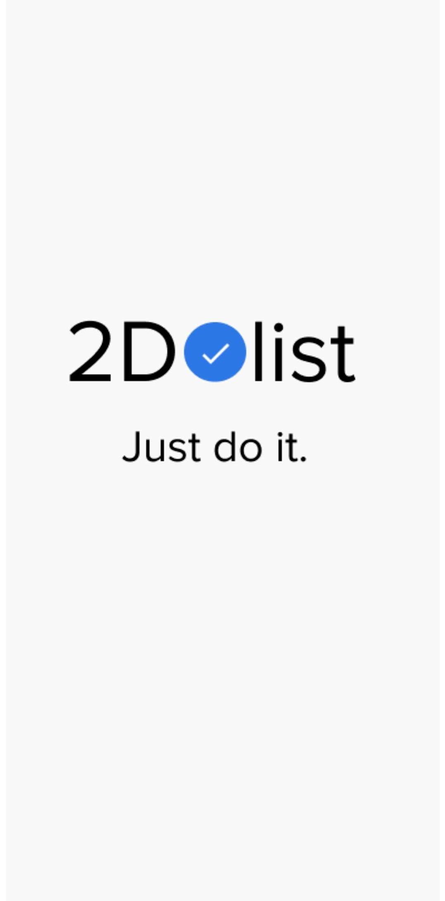
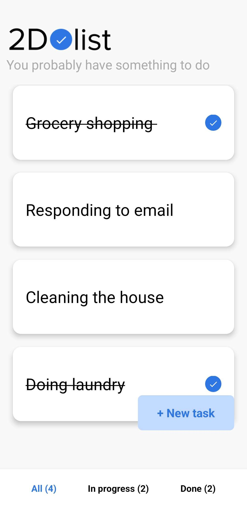
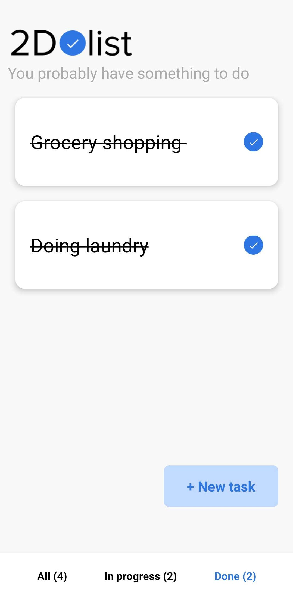
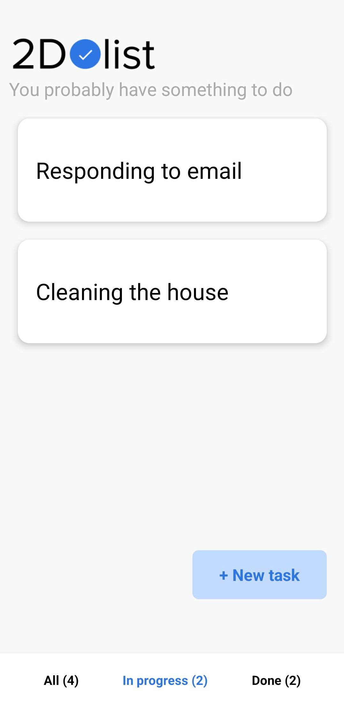
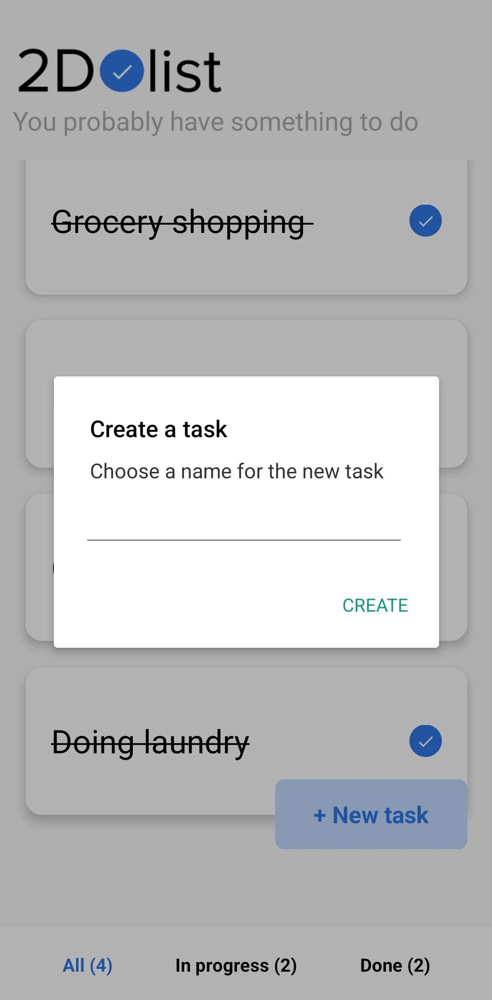
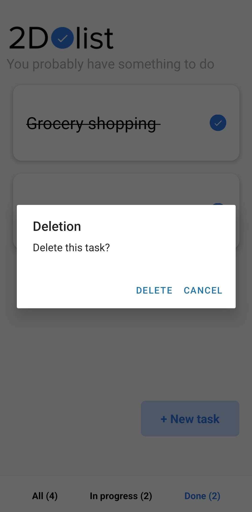

# Todo List Application

This project is a todolist mobile app make in React Native and Expo.

# Informations

- [Download the app for Android](https://github.com/SebastienCozeDev/todolist-app/releases/download/v1.0.0/todolist-app-latest.apk).
- [View code](https://github.com/SebastienCozeDev/todolist-app).

## Installation

Use the package manager [npm](https://www.npmjs.com/) to install the dependencies.

```bash
npm install
```

## Usage

To run the project, use the following command:
```bash
npx expo start
```
You can then use the Expo Go app on your phone to scan the QR code and run the app on your phone.

## Build

To build the project, use the following command:
```bash
eas build -p android --profile preview
```
You can then download the APK file from the [Expo website](https://expo.io/).

## Screenshots

### Splash Screen



### All Tasks Tab



### Done Tasks Tab



### In Progress Tasks Tab



### Create Task Modal



### Delete Task Modal



## Features

- Add a task
- Remove a task
- Mark a task as done
- Save tasks in local storage
- Load tasks from local storage
- Display the number of tasks
- Display the number of done tasks
- Display the number of in progress tasks
- Display the list of tasks
- Display the list of done tasks
- Display the list of in progress tasks

## Technologies

- [React Native](https://reactnative.dev/)
- [Expo](https://expo.io/)
- [Async Storage](https://react-native-async-storage.github.io/async-storage/)

## License

[MIT](https://choosealicense.com/licenses/mit/)

## Author

[Sébastien COZE](https://sebastien.cozedev.com/)
